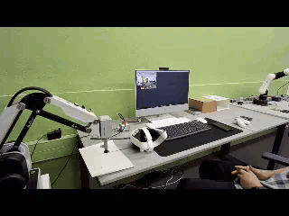

# Robot-VR-control
Control the dobot mg400 robotic arm with the Meta Quest 3 virtual reality headset + voice control + visual control
# Real-Time VR & AI Robotic Arm Controller (Robot-VR-control)

An advanced, multithreaded cyber-physical system built to establish real-time teleoperation and control over the **Dobot MG400** robotic arm. By integrating **Meta Quest 3** VR hardware with **Python-driven AI algorithms**, this project bridges immersive virtual reality environments with precise physical automation.

---

## 🚀 Key Features

*   **Immersive VR Teleoperation:** Real-time tracking of the Meta Quest 3 Right Controller's position to control the physical robotic arm coordinates over UDP.
*   **Dual-Stream Vision:** High-speed streaming of live webcam feeds back to the VR headset, including target tracking visual overlays.
*   **AI-Powered Hand Tracking:** Real-time computer vision integration using MediaPipe to map hand movements dynamically.
*   **Offline Voice Automation:** Integrated offline speech recognition via the Vosk framework to dispatch asynchronous voice commands to the robot.
*   **Safe Network Architecture:** Implements optimized C# UDP/TCP sockets in Unity and low-latency multithreaded networking loops in Python to ensure stutter-free performance.

---

## 🏗️ Repository Architecture
~~~
The repository archives the progressive evolution of the project's development across distinct logical layers:

├── Unity_Project/                # Immersive XR Environment
│   ├── SampleScene.unity        # Main virtual reality control layout
│   ├── VRControllerTracker.cs  # Extracts Quest 3 tracking data and dispatches to Python
│   ├── WebcamStreamReceiver.cs  # Receives and renders external camera streams on Unity main thread
│   └── LiveRobotCamera.cs       # Direct interface for local virtual/physical camera drivers (e.g., Iriun)
│
├── c1.py                        # Architecture initialization and base network routing
├── c2.py                        # TCP/IP communication protocols and Dobot MG400 API integration
├── c3.py                        # UDP listener loop for Quest 3 controller packet parsing
├── c4.py                        # MediaPipe pipeline execution and frame-buffer streaming to Unity
└── c5.py                        # Vosk speech processing engine and finalized multithreaded robot controller
~~~

**📸Final output of the project:**

 **🥽Project output in headset control**

✏️Note:In the section on controlling the robot with the headset controller, in the program I wrote, to prevent unwanted movements, the robot moves when the gripper button on the right controller is held down. Also, to return to the starting point, simply press the A button on the right controller.

  **🎙️Project output in control with voice         commands**
.
✏️Note:In the robot control section with voice commands, the robot moves with the commands right, left, up, and down and returns to the initial position with the reset command.

**👋Project output in gesture control**
.
✏️Note:In the section on controlling the robot with hand gestures, in the program I wrote, to prevent unwanted movements, the robot moves when the index finger of the right hand is up. Also, to return to the starting point, the left hand must be held above the marked red line for three seconds.

**⚙️ Configuration & Installation**
  1. Unity Environment Setup
    Ensure Unity 2022.3 LTS (or newer) is installed with the OpenXR and XR Interaction Toolkit packages enabled.
    Set the color pipeline to URP (Universal Render Pipeline) to maintain optimal refresh rates inside the Meta Quest 3 headset.
    Attach VRControllerTracker.cs and WebcamStreamReceiver.cs to your active tracking nodes or display quads within the scene.

 2. Python Environment Setup
   Install the necessary dependencies utilizing your terminal:
         "pip install opencv-python mediapipe vosk numpy"
   Make sure to download your preferred language model from Vosk and extract it into a folder named "model" in the root directory.

 3. Execution Sequence
   1. Run the targeted Python control script (e.g., python c5.py).
   2. Boot your Meta Quest 3 headset and build/play the Unity project scene.
   3. Hold the Grip Button on the Right Controller to initialize real-time robot arm teleoperation.

**⚠️ Safety Protocols & LimitsDisplacement** Thresholds:
   The Unity scripts enforce a mandatory 0.005f (5mm) minimum translation de QQlta to prevent noise jitter from triggering micro-oscillations in the robot's actuators.
   Network Rate Limiting: Data is throttled to send every 100ms ($10\text{ Hz}$). Forcing a higher frequency without proper hardware buffers may cause connection overhead or robot safety locks.

**-----------⭐Appreciation⭐---------------**
In conclusion, I would like to thank all those who helped me in this project, including **my family** and my dear friend,**Ali Najarzadegan**, without whose help and guidance this project would not have been possible, as well as the **Industry 4.0 Development Laboratory** in Isfahan University of Technology, which provided me with the necessary equipment to carry out this project, and all those who helped me in any way in carrying out this project.
**And I dedicate this project to the martyr Dr. Mostafa Chamran, who has been my best role model in life.**
